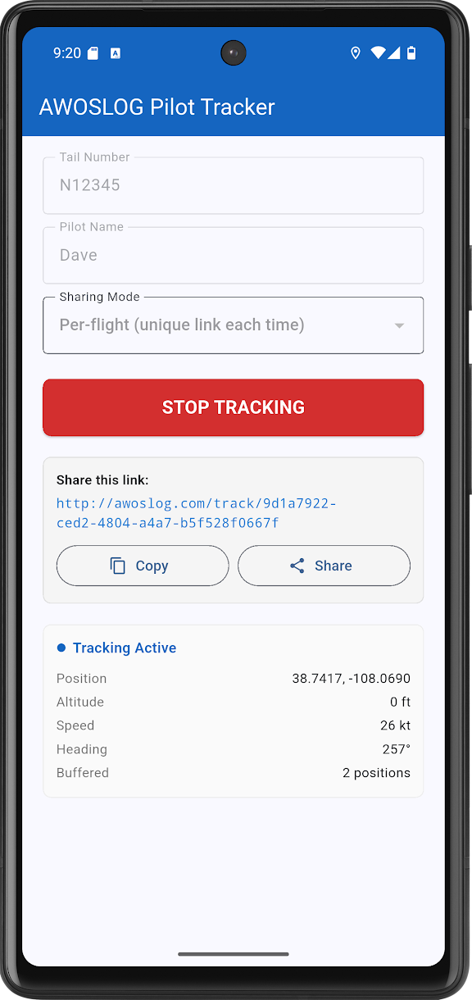

# awoslog-pilot

A free, private flight tracker for general aviation pilots. Share your position with the people you choose — no one else.

<p align="center">
  
</p>

## The Problem

Pilots have two options for sharing their position with family: expensive satellite messengers that cost hundreds per year with limited breadcrumbs, or ADS-B which broadcasts your every move to the entire internet where commercial services monetize your location data without your consent.

Neither option respects pilot privacy. The satellite messenger charges you for the privilege. ADS-B gives you no choice at all — your position is collected, aggregated, and sold by companies you never agreed to do business with. Even FAA blocking programs (LADD/PIA) are incomplete and inconsistent.

## The Solution

AWOSLOG Pilot Tracker streams your GPS position from the phone you already carry to [awoslog.com](http://awoslog.com), where it appears on a live map with a breadcrumb trail showing your flight path.

**You control who sees it.** Before takeoff, you get a share link. Text it to your spouse, your flight instructor, your partners — whoever you want. Only people with that link can see your flight. No one else. Not the public, not aggregators, not advertisers.

**Your data is never stored.** Positions are held in memory on the server for 2 hours after your last update, then they're gone. No database. No logs. No history for anyone to mine later. When your flight is over, it disappears.

**It's free.** No subscription, no hardware to buy, no account to create. Open the app, enter your tail number, tap Start, and share the link. That's it.

## How It Works

```
Your phone (GPS every 10 seconds)
    |
    |  HTTP POST to awoslog.com (cellular)
    |  Buffered locally when no signal
    |
    v
awoslog.com (in-memory only, 2-hour expiry)
    |
    |  Real-time SSE stream
    |
    v
Share link -> family watches on a live map
```

1. Open the app, enter your tail number and name
2. Choose sharing mode:
   - **Per-flight** — generates a unique link for this flight only. People with the link cannot see your future flights.
   - **Tail number** — uses your N-number as the link. Anyone you've shared it with can check if you're flying anytime.
3. Tap **Start Tracking**
4. Text the share link to whoever you want
5. Fly
6. They watch at `awoslog.com/track/your-link`

## What Your Family Sees

The share link opens a full-screen map showing:
- Your aircraft icon moving in real time
- A green breadcrumb trail of your flight path
- Altitude, ground speed, and heading
- "Live" indicator when positions are flowing
- "Last seen X ago" when signal is lost (with the trail preserved)

The map auto-follows your position. If they pan away, a "Re-center" button brings them back.

## Privacy Model

Your privacy is not a feature we added — it's the foundation the system is built on.

- **No accounts.** No email, no password, no profile.
- **No public display.** Your flight never appears on the awoslog.com main map.
- **No storage.** Positions exist in server memory only. After 2 hours of no updates, everything is erased.
- **No tracking history.** There is no database of your past flights. When it's gone, it's gone.
- **No third-party access.** We don't sell, share, or expose your data to anyone.
- **The link is the key.** A per-flight link uses a UUID (128 bits of randomness) — it cannot be guessed. Only people you give it to can see your flight.
- **Tail number links are opt-in.** You choose whether to use a persistent link or a one-time link. The default is one-time.

## Offline Buffering

Cell coverage is spotty at altitude, especially in mountainous terrain. The app handles this:

- GPS works everywhere (it only receives satellite signals — no cell needed)
- When you have no cell signal, positions are stored locally on your phone in a SQLite buffer
- When signal returns (on descent, typically), all buffered positions are pushed to the server as a batch
- The share page backfills the trail retroactively — your family sees the full flight path, including the part over the mountains where you had no signal

The buffer holds up to 10,000 positions (~28 hours at 10-second intervals). More than enough for any GA flight.

## Requirements

- Android phone (iOS coming soon — requires Mac for build)
- Cellular data (WiFi works for testing)
- No account needed on awoslog.com

## Installing on Android

### From APK (sideload)

Download the latest APK from the [Releases](https://github.com/dgallant0x007/awoslog-pilot/releases) page. On your phone:

1. Transfer the APK to your phone (email, USB, cloud drive)
2. Open it — Android will ask to allow installation from unknown sources
3. Install and open

### From source

```bash
git clone https://github.com/dgallant0x007/awoslog-pilot.git
cd awoslog-pilot
flutter pub get
flutter build apk
```

The APK is at `build/app/outputs/flutter-apk/app-release.apk`.

To run on a connected device:
```bash
flutter run
```

## Building for iOS

Requires a Mac with Xcode and the Flutter SDK installed.

```bash
git clone https://github.com/dgallant0x007/awoslog-pilot.git
cd awoslog-pilot
flutter pub get
flutter build ios
```

## App Permissions

The app requests:
- **Location (always)** — GPS tracking in the background with the screen off
- **Internet** — pushing positions to awoslog.com

That's it. No contacts, no camera, no storage beyond the local position buffer.

## Share URLs

Two types, chosen before each flight:

### Per-flight link (default)
```
awoslog.com/track/550e8400-e29b-41d4-a716-446655440000
```
- Unique to this flight session
- Cannot be reused to see future flights
- Expires 2 hours after the last position update
- **Best for:** one-time sharing with people who don't need ongoing access

### Tail number link
```
awoslog.com/track/N1234C
```
- Uses your N-number as the identifier
- Shows your current flight whenever one is active
- Returns "Track not found" when you're not flying
- **Best for:** family members who always want to be able to check

## How It Compares

| | AWOSLOG Pilot | InReach / Spot | ADS-B Tracking |
|---|---|---|---|
| Cost | **Free** | $150-400/yr | Free (involuntary) |
| Hardware | **Phone you carry** | Dedicated device | Transponder (required) |
| Privacy | **You choose who sees** | Configurable | Public by default |
| Data retention | **None (2hr memory)** | Stored permanently | Stored permanently |
| Update rate | **10 seconds** | 2-10 minutes | ~5 seconds |
| Offline buffering | **Yes** | Yes | N/A |
| Coverage | Cellular | Satellite (global) | Line-of-sight to ground station |

The tradeoff: satellite messengers work where there is no cell coverage (oceanic, remote wilderness). AWOSLOG Pilot works where there is cell coverage, which is most GA flying in the continental US, especially below 18,000 ft.

## Technical Details

### API

The app pushes to a single endpoint:

```
POST http://awoslog.com/api/pilot/push
```

```json
{
    "track_id": "550e8400-e29b-41d4-a716-446655440000",
    "tail": "N1234C",
    "pilot": "Dave",
    "positions": [
        {
            "lat": 38.5098,
            "lon": -107.894,
            "altitude": 10500,
            "speed": 115,
            "heading": 325,
            "accuracy": 5.2,
            "timestamp": 1711300000
        }
    ]
}
```

Positions are batched — a single push can contain hundreds of positions accumulated during an offline period.

### Server-side

The awoslog.com backend holds tracks in memory with a 2-hour TTL. No database writes. The share page connects via Server-Sent Events (SSE) for real-time updates. Source code for the server endpoints is in the [awoslog](https://github.com/dgallant0x007/web) repository.

### GPS Data

From the phone's GPS receiver:
- **Position**: latitude, longitude (typically +/-5m accuracy)
- **Altitude**: GPS-derived, converted to feet (+/-30-50 ft typical)
- **Speed**: GPS ground speed, converted to knots
- **Heading**: direction of travel in degrees true

Barometric altitude is not available via the standard location APIs. GPS altitude is sufficient for tracking purposes but should not be used for navigation.

## Project Structure

```
awoslog-pilot/
    lib/
        main.dart                     App entry point
        screens/
            home_screen.dart          Main UI: toggle, settings, share URL
        services/
            gps_service.dart          GPS location stream
            push_service.dart         HTTP push to awoslog.com
            buffer_service.dart       SQLite offline buffer
        models/
            position.dart             Position data model
            settings.dart             App settings and persistence
    android/                          Android platform config
    ios/                              iOS platform config
```

## Contributing

This is an open-source project. Contributions are welcome — especially from pilots who can test in real flight conditions.

## License

MIT
